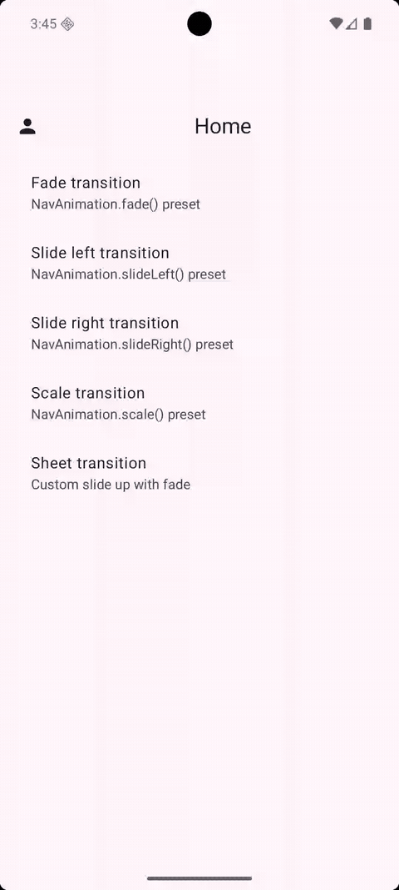

# ComposeNavMotion

**ComposeNavMotion** is a lightweight, plug-and-play animation preset library for **Jetpack Compose Navigation**. Built with Compose Animation and Navigation Compose — add polished screen transitions in minutes, or compose fully custom animations with shared duration and easing.

**Report a bug** · **Contributing** · **License**



---

## Table of contents

* Preview
* Features
* Installation
* Quick start
* Preset animations
* Custom animations
* Sample app
* Project structure
* Contributing
* License
* Author

## Features

| Feature | Description |
| --- | --- |
| **Preset transitions** | `fade`, `slideLeft`, `slideRight`, `slideUp`, `scale` |
| **Custom builder** | Compose transitions with shared duration and easing |
| **Pop support** | Matching back-stack enter/exit animations |
| **Simple API** | One extension: `animatedComposable()` |
| **Defaults** | 300 ms duration, `FastOutSlowInEasing` |
| **Testable** | Pure Kotlin specs with unit tests |

---

## Preview

The sample app demo above shows:

- Home list navigation with profile entry
- Detail screen transitions using `slideLeft`
- Profile screen with custom horizontal slide
- Sheet screen with mixed slide-up and fade animations

---

## Installation

### Maven Central

```kotlin
// settings.gradle.kts
dependencyResolutionManagement {
    repositories {
        google()
        mavenCentral()
    }
}
```

```kotlin
// build.gradle.kts
dependencies {
    implementation("io.github.saadkhalidkhan:composenavmotion:1.0.0")
}
```

### JitPack

```kotlin
// settings.gradle.kts
dependencyResolutionManagement {
    repositories {
        google()
        mavenCentral()
        maven { url = uri("https://jitpack.io") }
    }
}
```

```kotlin
dependencies {
    implementation("com.github.saadkhalidkhan:ComposeNavMotion:1.0.0")
}
```

See [PUBLISHING.md](PUBLISHING.md) for release steps and CI setup.

### Local module (development)

```kotlin
// settings.gradle.kts
include(":nav-animation")

// app/build.gradle.kts
dependencies {
    implementation(project(":nav-animation"))
}
```

---

## Quick start

```kotlin
import com.composenavmotion.NavAnimation
import com.composenavmotion.animatedComposable

NavHost(navController, startDestination = "home") {
    animatedComposable(
        route = "details",
        animation = NavAnimation.slideLeft(),
    ) {
        DetailsScreen()
    }
}
```

---

## Preset animations

```kotlin
NavAnimation.fade()
NavAnimation.slideLeft()
NavAnimation.slideRight()
NavAnimation.slideUp()
NavAnimation.scale()
```

Each preset returns a `NavAnimationSpec` with enter, exit, pop enter, and pop exit transitions.

---

## Custom animations

Transitions are built with lambdas on `AnimationConfig`, so duration and easing stay under library control via `tweenSpec()`.

### Horizontal slide

```kotlin
NavAnimation.custom(
    enter = { slideInHorizontally(animationSpec = tweenSpec()) },
    exit = { slideOutHorizontally(animationSpec = tweenSpec()) },
)
```

### Fade

```kotlin
NavAnimation.custom(
    enter = { fadeIn(animationSpec = tweenSpec()) },
    exit = { fadeOut(animationSpec = tweenSpec()) },
)
```

### Mixed animation

```kotlin
NavAnimation.custom(
    enter = { slideInVertically(animationSpec = tweenSpec()) },
    exit = { fadeOut(animationSpec = tweenSpec()) },
    popEnter = { fadeIn(animationSpec = tweenSpec()) },
    popExit = { slideOutVertically(animationSpec = tweenSpec()) },
    duration = 350,
)
```

---

## Sample app

```bash
./gradlew :app:installDebug
```

Demonstrates preset `slideLeft`, a custom horizontal profile screen, and a mixed slide-up / fade sheet screen.

---

## Project structure

| Module | Description |
| --- | --- |
| `:nav-animation` | Android library (minSdk 26) |
| `:app` | Demo application |

---

## Contributing

Contributions are welcome. Please read [CONTRIBUTING.md](CONTRIBUTING.md) before opening an issue or pull request.

Run `./gradlew :nav-animation:testDebugUnitTest :app:assembleDebug` before opening a PR.

---

## License

This project is licensed under the **Apache License 2.0** — see [LICENSE](LICENSE).

```
Copyright 2026 Saad Khan
```

## Author

**Saad Khan** — [GitHub](https://github.com/saadkhalidkhan) · ranasaad0799@gmail.com

If this library helps you, consider starring the repo.
